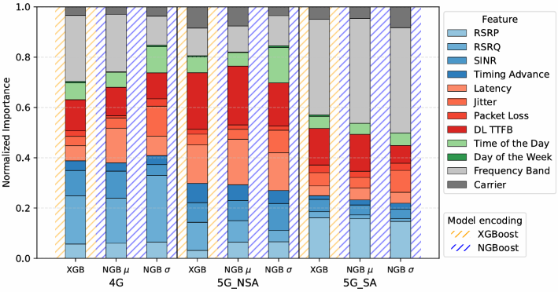

# Characterizing 5G User Throughput via Uncertainty Modeling and Crowdsourced Measurements

Codebase for the paper [Characterizing 5G User Throughput via Uncertainty Modeling and Crowdsourced Measurements](https://arxiv.org/abs/2510.09239).



### Abstract

Characterizing application-layer user throughput in next-generation networks is increasingly challenging as the higher capacity of the 5G Radio Access Network (RAN) shifts connectivity bottlenecks towards deeper parts of the network. Traditional methods, such as drive tests and operator equipment counters, are costly, limited, or fail to capture end-to-end (E2E) Quality of Service (QoS) and its variability. In this work, we leverage large-scale crowdsourced measurements-including E2E, radio, contextual and network deployment features collected by the user equipment (UE)-to propose an uncertainty-aware and explainable approach for downlink user throughput estimation. We first validate prior 4G methods, improving R^2 by 8.7%, and then extend them to 5G NSA and 5G SA, providing the first benchmarks for 5G crowdsourced datasets. To address the variability of throughput, we apply NGBoost, a model that outputs both point estimates and calibrated confidence intervals, representing its first use in the field of computer communications. Finally, we use the proposed model to analyze the evolution from 4G to 5G SA, and show that throughput bottlenecks move from the RAN to transport and service layers, as seen by E2E metrics gaining importance over radio-related features.

---

## Structure

All the code of this repository is organized into clear directories to separate the experiment pipeline, configuration, and analysis notebooks:

- configs/: Configuration file (YAML format) specifying data, experiment, model, evaluation and logging parameters.
- data/: Input data directory containing a small dummy dataset, *throughput.csv*.
- notebooks/: Analysis and visualization notebooks.  
  - *explainability.ipynb*: Notebook for generating SHAP explainability plots.  
- src/char5g/: Core Python package implementing the complete throughput modeling pipeline.
  - *data_loader.py*: Handles data ingestion and preprocessing.  
  - *train.py*: Training routines for both XGBoost (deterministic baseline) and NGBoost (uncertainty-aware) models.  
  - *eval.py*: Model evaluation and explainability tools. Computes performance metrics (MAE, RMSE, R², CRPS), calibration curves, confidence interval plots, and SHAP explainability values.  
  - *pipeline.py*: Main orchestrator that ties the full experiment together — from data loading to training and evaluation.
  - *utils.py*: Utility functions for configuration management, logging setup, and experiment folder handling.  
- *main.py*: Entry point script for running experiments.  
- *requirements.txt*: Python dependencies.  
- *pyproject.toml*: Python module file.  

---

## Installation

### Cloning the Repository

You may start by cloning the repository and installing dependencies:

```bash
git clone https://github.com/jas-upm/characterizing-5g-throughput.git
cd characterizing-5g-throughput
```

### Virtual Environment

If you want to create a virtual environment:

```bash
python -m venv .venv
source .venv/bin/activate      # Linux/Mac
.venv\Scripts\activate         # Windows
```

### Dependencies

To install dependencies, you can use either:

**Option 1** – Using pyproject.toml (recommended)
```bash
pip install .
```

**Option 2** – Using requirements.txt
```bash
pip install -r requirements.txt
```


---

## Running Experiments

### Main Pipeline

Run the 5G throughput modeling and evaluation pipeline from the command line:

```bash
python -m main
```

Example usage:

```bash
# Run a new experiment using the default configuration file
python -m main

# Resume from the latest experiment directory
python -m main --resume

# Reuse a specific experiment folder
python -m main --exp_dir artifacts/2025-10-15_12-00-00

# Add a custom configuration file and experiment name
python -m main --config configs/experiment.yaml --experiment_name spain_5g_test
```

### Results and Artifacts

After running the main experiment pipeline, all outputs are automatically stored in a timestamped directory under `artifacts/`.  
For example:
```
artifacts/2025-10-15_15-26-40/
```

Each experiment directory contains the following subfolders and files:

- data_splits/
  - *Xy_train_val_test.pkl*: Pickle file containing the training, validation, and test sets used for model evaluation.
- eval/
  - *4G_CIs.pdf, 5G_NSA_CIs.pdf, 5G_SA_CIs.pdf*: Confidence interval plots for throughput predictions across different technologies (4G, 5G NSA, 5G SA).  
  - *4G_calibration.pdf, 5G_NSA_calibration.pdf, 5G_SA_calibration.pdf*: Model calibration plots showing how predicted uncertainty aligns with observed throughput distributions.  
  - *metrics_test.json*: JSON file summarizing quantitative performance metrics (MAE, RMSE, R², CRPS) on the test set for each model.  
  - *test_shap_values.pkl*: Serialized SHAP values for all test samples, used in the explainability notebook.
- logs/:
  - *run_YYYYMMDD_HHMMSS.txt*: Console logs for each execution, including training summaries, validation losses, and evaluation reports.
- models/
  - *XGBoost_model_4G.pkl*, XGBoost_model_5G_NSA.pkl, XGBoost_model_5G_SA.pkl: Deterministic baseline models trained per technology.  
  - *NGBoost_model_4G.pkl*, NGBoost_model_5G_NSA.pkl, NGBoost_model_5G_SA.pkl: Uncertainty-aware models with predictive distributions.  
  - *summary_metrics_val.json*: Validation performance summary used for model comparison.
- config.yaml: The exact configuration file used for this run (copied automatically from `/configs`).

### Explainability

The explainability notebook (`notebooks/explainability.ipynb`) provides SHAP-based interpretability of the trained models, following the structure:

1. Prepare Data – Load configuration files, SHAP values, and feature definitions.  
2. Visualize Plots – Generate three sets of explainability results:  
   - Normalized Mean Absolute SHAP Values – Summarizes overall feature importance evolution from 4G to 5G SA.  
   - Feature Value vs. SHAP Values – Shows how individual features influence predictions (e.g., Frequency Band, RSRP, DL TTFB).  
   - Feature Importance Ratios – Quantifies the shift in feature relevance between 4G and 5G SA.  

These visualizations provide interpretable insight into how network parameters affect throughput predictions.

---

## Reference

To cite our work please use the following BibTeX entry:

```bibtex
@article{albertsmet2025characterizing,
  title={Characterizing 5G User Throughput via Uncertainty Modeling and Crowdsourced Measurements},
  author={Albert-Smet, Javier and Frias, Zoraida and Mendo, Luis and Melones, Sergio and Yraola, Eduardo},
  journal={arXiv preprint arXiv:2510.09239},
  year={2025}
}
```